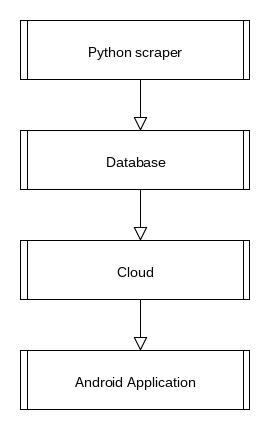

## Content ​ Page Number

- 1 Introduction ​
   - 1.1 Overview ​
   - 1.2 Business Context ​
   - 1.3 Glossary
- 2 General Description ​
   - 2.1 Product/System Function
   - 2.2 User Characteristics and Objectives ​
   - 2.3 Operational Scenarios
   - 2.4 Constraints
- 3 Functional Requirements ​
   - 3.1 External Requirements
      - 3.1.1 Software requirements
      - 3.1.2 Hardware requirements
   - 3.2 Functions ​
      - 3.2.1 Web scraping ​
      - 3.2.2 Storing information in database
      - 3.2.3 Pulling information and displaying it ​
      - 3.2.4 Log in ​
      - 3.2.5 Spotify link
      - 3.2.6 Filter Events ​
      - 3.2.7 Select favourite events/venues
   - 3.3 Performance requirements ​
   - 3.4 Database requirements
   - 3.5 Constraints
   - 3.6 Availability
- 4 System Architecture ​ 1 ​
   - 4.1 System Architecture Diagram ​ 1 ​
   - 4.2 Python Scraper ​ 1 ​
   - 4.3 Database ​ 1 ​
   - 4.4 Cloud ​ 1 ​
   - 4.5 Android Application ​ 1 ​
- 5 High Level Design ​ 1 ​
   - 5.1 Data Flow Diagram ​ 1 ​
   - 5.2 Description ​ 1 ​
- 6 Preliminary Schedule ​ 1 ​
- 7 Appendices ​ 1 ​

# 1 Introduction

### 1.1 Overview ​

The Dublin events app is an Android application that will allow the user to view
upcoming events in pubs or venues. All the events will be sorted and categorized based
on the users preference, for example the type of event(comedy,music,sports,etc), event
venue(pub,nightclub,arena,etc), and location(close to you,in the City Center). Users will
be able to see the name of the event, a short description, the location, and ticket prices
if applicable.
Users will be able to login and favourite events or venues. This will allow users to get
reminded before the event starts and find favorited events or venues quicker. Users will
also be able to link up their spotify accounts and the application will be able to notify the
users of events by artist that they listen to frequently.

### 1.2 Business Context ​

Promotion companies could use our app to further advertise their events by adding the
promoted content to the top of the list. Lesser known events could use our platform to
gain more exposure to an audience that may have not been aware of the event thus
generating business revenue.

### 1.3 Glossary

_Java_
Java is an object-oriented programming language.
_Python_
Python is a high level programming language.
_Sqlite_

SQLite is a relational database management system. It is usually attached to the end
program.
_Web-Scraper_
A web-scraper is a program that pulls information from websites using the Hyper
Transfer Protocol.

# 2 General Description

### 2.1 Product/System Function

The application is an Android phone app that will allow users to view upcoming events
in Dublin. The application will include pub events along side events in popular venues.
Users will be able to view the events based on their preferences, they will be able to
sort based on location/event name/event time or date/artist etc.The data will be
automatically separate pub events and venue events. The user will be able to choose
between either and also be able to filter through the events.
Users will be able to see how much the event costs and where to get the tickets for the
event, they will be able to see the name of the event and a short description. They will
be able to see when the event starts and where it will be held.
Users will be able to login to the application by logging in through their google account
and favourite events, this will allow users to get information quickly about the event and
a reminder when the event is coming up. Users will be able to link their spotify accounts
within the app that will allow the application to notify the user when there is an event by
an artist they listen to or follow coming up.
The application will pull information from a database that will be hosted on the
000webhost cloud hosting service. The database will be built using SQLite and python
and it will contain all the data that the application will gather and sort. The information
will be gathered using a python scraper to look for event information on event websites.
We will use a facebook api to gather events in pubs.

### 2.2 User Characteristics and Objectives ​

The user should not require a high technical understanding to use the application.
Therefore we will have to make sure we make the application straightforward to use and
have no ambiguities. The user should be easily able to find the search feature and find
the correct events that they are looking for. The users should be able to login in easily
and have all of their favourite events show up and display the relevant information. The
information displayed should be easily understood. There should be no irrelevant
information and the information that is displayed should be concise. The user should be

able to quickly see the price of the event, what date it is on and what time it starts at,
and the location of the event.
The user should easily be able to connect their spotify accounts and see the
recommended events by artist they enjoy if there is any. They will be notified if there is
an event by an artist that they listen to. The android app should be able to quickly fetch
the information from the database minimising wait time.

### 2.3 Operational Scenarios

1. User Login
    a. The user will be able to login by syncing up their google accounts if they
       choose to accept the terms they will be logged in otherwise they will
       continue without logging in.
2. View Events
    a. Users will be able to quickly view information about events. They will able
       to see the price, the place, the time, the location of the event, and a short
       description of the event.
3. Favourite Events
    a. The user will be able to add events to their favourites. This will allow users
       to get reminded before the event and to be able to find events that they
       have favourited quicker.
4. Search/Filter Function
    a. The user will be able to search for a specific event using the inbuilt search
       function. This will sort all of the data based on the users search input. A
       user can enter a keyword and they will get events based off of the word
       that they searched for. For faster filtering the user will be able to sort the
       data by filtering it by date,location,or event type.
5. Spotify integration
    a. Using spotify the user will be able to have certain events recommended to
       them based on the artists that they listen to.

### 2.4 Constraints

Time Constraints:

The first constraint is the demonstration date 12th to the 23rd of March. All code must
be completed and demonstrated before a supervisor and assessor.
Data Constraints:
Since our data is gathered from other websites we cannot guarantee that we will be
able to display every event in Dublin. We can only gather information from a limited
amount of websites and display all the information that we gather.
Cost constraints:
Since we will be using a free cloud hosting site to host our database we will have to limit
the scale of the project as we have a limited amount of space available on a free
account.

# 3 Functional Requirements

### 3.1 External Requirements

#### 3.1.1 Software requirements

Our software will be run as an android application, which will be written in Java, and our
database will be contained on a linux server. We will use python for web scraping to get
our information and we will use SQLite for our database.

#### 3.1.2 Hardware requirements

We will require a lightweight server to run our web-scraping program and to host our
database. The program should not be too heavy on resources so we will not require a
very powerful android device to run it on.

### 3.2 Functions ​

#### 3.2.1 Web scraping ​

Description​ : This will be a program written in python that will pull information from
various sites. That information will be later placed in our database. This program will be
run from our server at a certain interval.
Criticality​ : This will be very important because it is where we will be getting all of our
information.
Technical issues​ : The issues we may have with this function is that some of the regular
expressions for getting the information may be difficult to write.

#### 3.2.2 Storing information in database

Description​ ​: Information that is pulled from the websites will be organised and stored in
a database on a server. The information that will be stored will be a title, location,
time/date and a description of the event and possibly a link to a picture related to the
event.
Criticality​ : This will be important as this is how the application will get the information to
display.
Technical issues​ : We will need to make sure that we have a unique key for events as
we don’t want to store the same event multiple times.
Dependencies with other requirements​ : This will obviously depend on the web scraper
to find all the correct and sufficient information.

#### 3.2.3 Pulling information and displaying it ​

Description​ : Our application will connect to our server and pull out general or specific
information on events. It will then display it in an organised way.
Criticality​ : Pulling the information will be necessary and very important as otherwise the
app will have nothing to display.
Technical issues​ : We will need to make sure the interface is easy to look at so as not to
confuse the users.
Dependencies with other requirements​ : This requires the information to be in the
database.

#### 3.2.4 Log in ​

Description​ : Our application will have a login feature where you can log in with your
gmail and it will retrieve your preferences.

Criticality​ : This function will not be too important but will be great if people need to
reinstall or switch to a new device.
Technical issues​ : There should be too many issues with this as there is an api for this
feature.
Dependencies with other requirements​ : This does not depend on any other functions.

#### 3.2.5 Spotify link

Description​ : Our application will have the option of logging into your spotify to find your
most listened artists so the app can preference them if they have any events on.
Criticality​ : This feature is not necessary to the functionality of the rest of the app.
Technical issues​ : There should also be very few issues with this as there is also an api
to help us.
Dependencies with other requirements​ : This will depend on selecting certain data from
the database so it can display the prefers events.

#### 3.2.6 Filter Events ​

Description​ : Our app will have a feature that lets users filter events into categories such
as comedy, music, club-nights, etc. This will make the app only display events from the
selected categories.
Criticality​ : This will not affect the overall functionality but will be important as users may
not want to see all the events that are on.

Technical issues​ : This will work off the description key to find out what kind of event
each will be.
Dependencies with other requirements​ : This will heavily depend on our database to
select specific events.

#### 3.2.7 Select favourite events/venues

Description​ : This will be a feature where users can select an event/venue as a favourite
so if that event is ever on again or if there is any event on in their favourite venue then
they will be alerted.
Criticality​ : This once again will not be necessary for the app to work but will be a nice
feature for users who like specific events.
Technical issues​ : We will probably store these favourites in another database where
each primary key will be generated from the users gmail accounts so they can keep
their favourites if they ever reinstall or switch device.
Dependencies with other requirements​ : This will rely on our database and will use
either save the event name and venue or just the venue name as the favourite.

### 3.3 Performance requirements ​

Server​ : The server we will need will not require a lot of storage as our database will not
be too large and will always be close to the same size as old events are removed from
the database and new ones are added. It will require decent memory as many will be
able to send requests at the same time.

### 3.4 Database requirements

Every event will have title, time/date, location and a description. Each event will have a
composite key to be identified which could be the date and the location.

### 3.5 Constraints

We are planning keeping this application to Dublin events only and the application will
run only on Android devices.

### 3.6 Availability

Our server will have to be available all the time as users must be able to access it
whenever they want. The server will update the database at certain intervals that may
change depending on how oftens the websites we will be scraping will post updates on
events​.

# 4 System Architecture

### 4.1 System Architecture Diagram ​ 1 ​

**Fig 4.
Fig 4.1** ​illustrates the architecture of the application. The diagram shows how the four
main classes will interact with one another. The first is the python scraper which will
gather all the relevant information for the database. Then the database, which will store
all of the scraped data. This is followed by the cloud which will host the database, and
finally the android application which will display the information to the user

### 4.2 Python Scraper ​ 1 ​

This is a very important part of the project. We must make sure we gather the correct
information. The event information will be gathered using python. We will program a
scraper to gather information about events from specific event websites. We will also
have to use a facebook api to gather specific events from pubs as they are updated
regularly on facebook. All the information gathered will be stored in a database.

### 4.3 Database ​ 1 ​

The SQLite database will store all the information that the python scraper gathers. This
is the information that the user will see but it will be retrieved by the android application.
The database will be hosted on a cloud and updated every three days to allow users to
retrieve information instantly.

### 4.4 Cloud ​ 1 ​

We will host the database on a cloud server provided by the 000webhost cloud
services. This will allow us to constantly have a database online, it will allow us to
quickly update the database and allow the Android application to show results quickly.

### 4.5 Android Application ​ 1 ​

This will be where all the information for the user will be displayed. The application will
be written in Java and will be solely for Android devices. Users will be able to download
the application and view events filtered by their preferences. We will have to make sure
the application is easy to use and the information will be displayed in a aesthetically
pleasing way.

# 5 High Level Design

### 5.1 Data Flow Diagram ​ 1 ​

**Fig 5.1-DFD**

### 5.2 Description ​ 1 ​

The data flow diagram shows how the data will be distributed inside our program. The scraper
will feed information to the database. A user will be able to filter information they want to see
based on date/location/venue or event type. Then the information will be gathered from the
database and filtered. Then it will be sent to be displayed on the application. A user can
favourite events or venues which will be stored on their device, and when the user logs in they
can choose to view it.

# 6 Preliminary Schedule

**Fig 6.1-Gantt Chart
Functional Spec -** ​We hope to complete the functional specification before the due
date on December. We will work on it while we have free time as we have a busy
college schedule.
**Python Scraper -** ​We hope to firstly start with the Python scraper to gather information
about events from other websites, this is a very important part of the project as we
cannot progress to the other parts of the project without the information that we need.
We hope to be able to have a fully functional scraper that allows us to gather all
required information by the end of January
**SQLite Database -** ​We hope to start setting up the database as soon as we are able to
extract some information from they python scraper. The database will be set up to
include all the information that was extracted by the scraper. We will try to complete the
database alongside the Python scraper.

**Cloud Hosting -** ​Since we do not have experience in cloud hosting we will reserve an
extra week to make sure that the database is hosted correctly and can be easily
accessed.
**Android Development -** ​We are allocating the most amount of time for the android
development as we have no experience in creating an Android app. We will spend the
first couple of days researching the best approaches to app development. We will start
by splitting up the work between the user interface and retrieving the information to
display on the UI. Once we are able to retrieve all the information from a database, we
will then work on filtering based on the user's request. The next step will be to allow
users to login using their google accounts and allow them to favourite events/venues.
After this we will add the spotify integration to recommend events by artists that the user
listens to.

# 7 Appendices

**Scraped Websites:** ​ ​https://www.facebook.com/
​http://www.ticketmaster.ie/
​https://www.eventbrite.ie/d/ireland--dublin/events/
​http://entertainment.ie/
**Research Tools:** ​https://developer.android.com/studio/index.html
​https://docs.python.org/3/
​https://sqlite.org/docs.html
​http://www.sqlcourse.com/
​http://facebook-sdk.readthedocs.io/en/latest/api.html
​https://www.crummy.com/software/BeautifulSoup/bs4/doc/
​https://www.000webhost.com/

