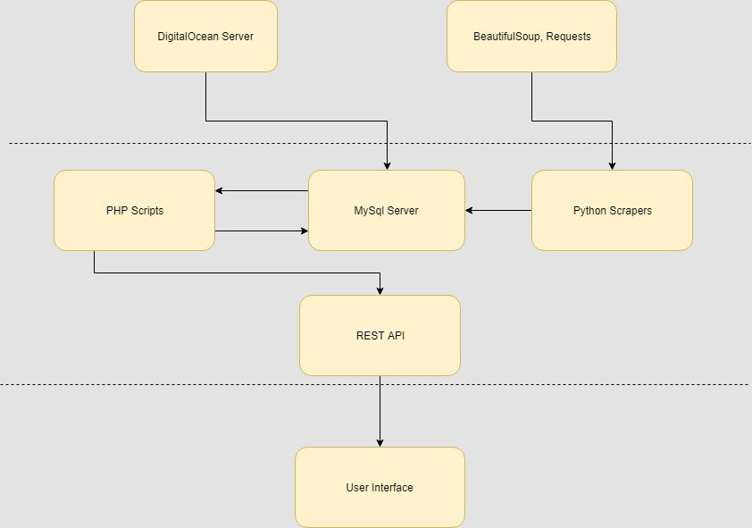
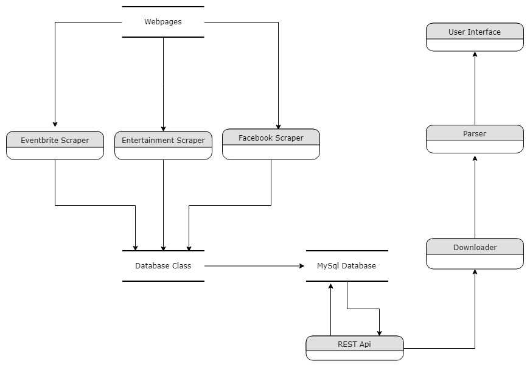
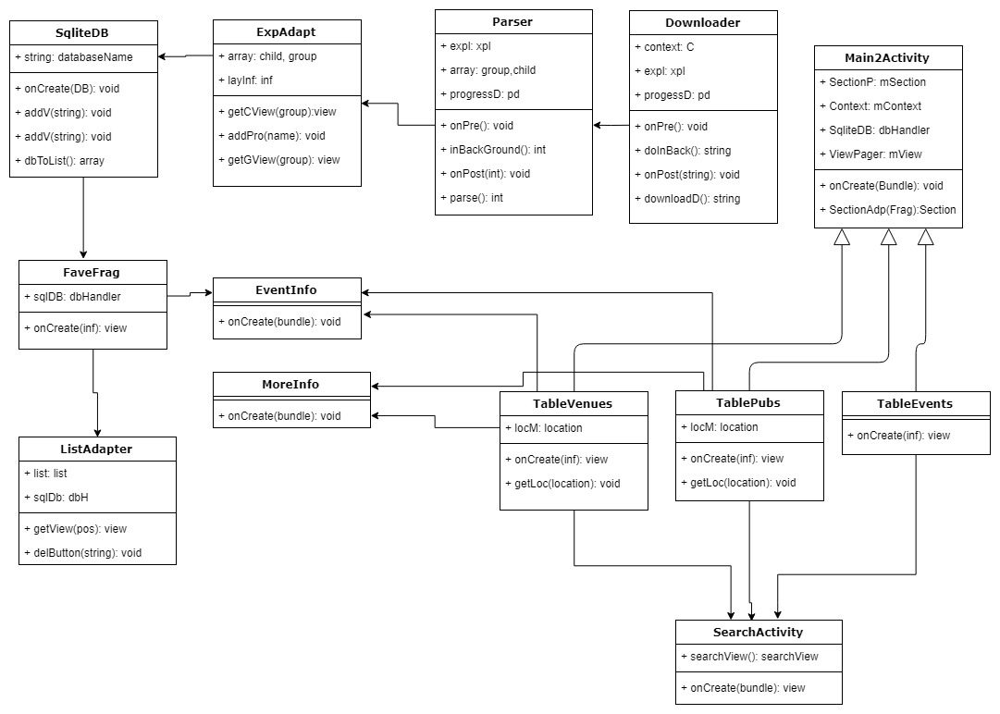

- 1. INTRODUCTION
   - 1.1 Overview
   - 1.2 Glossary
- 2. SYSTEM ARCHITECTURE
- 3. HIGH LEVEL DESIGN
- 4. PROBLEMS AND RESOLUTIONS
- 5. INSTALLATION GUIDE


## 1. INTRODUCTION

### 1.1 Overview

The aim of our project is to gather data about various events on in Dublin and display
on an android app so users can find out what events are on upcoming nights. The
users can choose how the events are categorized and displayed. The users may
also browse the venues they wish and see any events linked to their chosen venue.
They can favourite pubs or events so the details can be easier tracked. The data is
stored in a MySql database on a cloud server hosted by DigitalOcean. The location
of this server is in London. The data we use is collected using scrapers on different
event websites.
The websites we will be using for this will be eventbrite.ie, entertainment.ie and
facebook.com. The eventbrite scraper takes information from the first few pages of
different event categories. The entertainment scraper takes information from the first
few pages that are displayed under the event listings. Both of these scrapers are
made using the requests and BeautifulSoup libraries. The facebook scraper works
using the Facebook python API. This scraper is given a list of venue names gathered
from Google and checks if there are any events on in any of the listed venues. The
scrapers are run on the server once a day to update the events. The old events are
removed from the database once a day also. PHP is used to create a REST API so
the app can retrieve information.

### 1.2 Glossary

```
● Event
Any event on in a venue
● Venue
Any pub, music venue or location where there may be some event
● MySql
Database management system
● DigitalOcean
Website where cloud servers can be rented
● Scraper
A program or script that gets information from a webpage
```

```
● Eventbrite.ie
A website for buying tickets to events
● Entertainment.ie
An Irish website that has information about upcoming Dublin events
● Facebook.com
A social networking site that venues sometimes use to advertise their events
● Requests
A python package that fetches html from a given url
● BeautifulSoup
A python package used for parsing html
```
## 2. SYSTEM ARCHITECTURE

**Diagram**


Digital ocean is used to host our server. We use BeautifulSoup and Requests to build the
scrapers. The scrapers put the information into the MySql database. The database is
queried by the php scripts and creates a json REST api. The app, user interface, uses this
rest api to get the information to display.

## 3. HIGH LEVEL DESIGN

Back end
Our database contains two tables, events and venues. The composite key for venues is the
name and the address, and the composite key for event is the name, location and date/time.
The events has a foreign key on the location column that points to the name of a venue in
the venue table.
Our server has a python class that wraps around our database and is specifically made for
handling events in the form of tuples. It takes an event and checks the location first to see if
it exists in the venues table if it does not it will google the location to see if it can find more
info on it and if it finds a sufficient amount of info it adds it to the venues table before going
back to checking the rest of the event. It will then check if the event exists in the events table
if it does then it will just print an integrity error saying that it is a duplicate otherwise it will add
it. There is also a function that takes a generator that outputs event tuples and continues
until the generator stops.
The scrapers are written as multiple functions called as one generator function. This lets us
easily write new scrapers to interact with our database. Every scraper will write its output into
an log. These logs will contain information on what errors occurred and what events and
venues were added to the tables by that scraper.




Front end
The application front end runs on the android operating system. It is designed to work for
phones using API 15 and up. We have a base main activity class that is created when the
user opens the app. It automatically creates a view of the events database so that a user
can start browsing events instantaneously. Data is downloaded from the cloud server
database by creating a sql query in php that is then downloaded by the downloader class
and the information is then parsed and set in the parser class. Most unique queries required
a unique php script.
A user can favourite events or pubs and it is then added to the sqlite database on their
device, this allows users to quickly add and remove events or pubs from their favourites if
they wish to do so.



## 4. PROBLEMS AND RESOLUTIONS

### Geopy GoogleV3 Limit

Problem
The GoogleV3 class that comes with the geopy package is used to turn addresses
into coordinates and when we were using it at the beginning we did not have an api


key this meant we were very limited to how many requests we could make per
minute.
Resolution
We fixed this by getting an api key.

### Duplicates

### Problem

When the database tables were first used we were getting a few duplicates. We
realised this was because we had not set our primary keys properly.
Resolution
We fixed this by creating composite keys for the tables.

### Entertainment scraper

### Problem

The entertainment.ie scraper continually would not retrieve a certain p tag which
contained a description about the event.
Resolution
We could not fix this for a while until we decided to change the BeautifulSoup parser
from python’s built in library to “html5lib”. This fixed the problem.

### Unicode errors

### Problem

Some venue names contained fadas and accents on some websites but didn’t on
others so this was annoyingly inconsistent and was causing duplicates and/or
created unicode errors.
Resolution
We used the Unidecode python package to change the names back to normal letters
from the fadas and accents.


### Server Problem

### Problem

We originally planned to set up our own ssh server and mySql database on a
machine we had spare but we realised that the connection wasn’t consistent enough
and we spent too much time trying to fix it to no avail.
Resolution
We overcame this by switching to a DigitalOcean server instead.

### Search Button

### Problem

The search button wouldn’t appear on the first tab on the android app but would
appear on the others. If you swiped off the tab and back it would appear. If you
pressed the search icon after it appeared it would give you the results back on a
different tab.
Resolution
We overcame it by getting rid of the search icon completely and instead having a
search option in the drop down menu which started a new activity to allow a user to
search.

### Sqlite

### Problem

We could not initialize context from a fragment view, this was causing a null pointer
exception. Events were being added but weren’t actually be stored. Table was not
getting created at the launch of the app.
Resolution
We fixed these problems by creating a specific getContext method from the main
activity class. This allowed us to get the context initialized before we created the
database. After thorough testing we found that the route cause of the problem
occured in the addProduct method. We narrowed it down to 2 lines of code that were
switched around. This caused no error to be raised by the compiler so it was very
hard to track down the problem.

### Android mySql Connection

Problem
We could not get the jdbc library to connect to our database.
Resolution
We created a REST api with PHP to retrieve information from the database.


### Facebook API

Problem
When searching for pubs we would run out of api calls because we had many to go
through and because we had a public api which expired every 24 hours.
Resolution
We were able to get an extended API key by registering our app with the Facebook
api.

### Entertainment next page

Problem
When collecting the pages to scraped for entertainment.ie there was an error where
the link to the next page was not working because it just brought you back to the
same page.
Resolution
After lots of debugging and messing with browsers we learned that if the link started
with “www” it would not work so removed the “www” and it worked fine.

## 5. INSTALLATION GUIDE

The required python packages for the server-side of this project are contained in the
requirements.txt file. You can install these by running ‘pip install -r requirements.txt’
from your server console. You can download the android app from the Google Play
Store.


