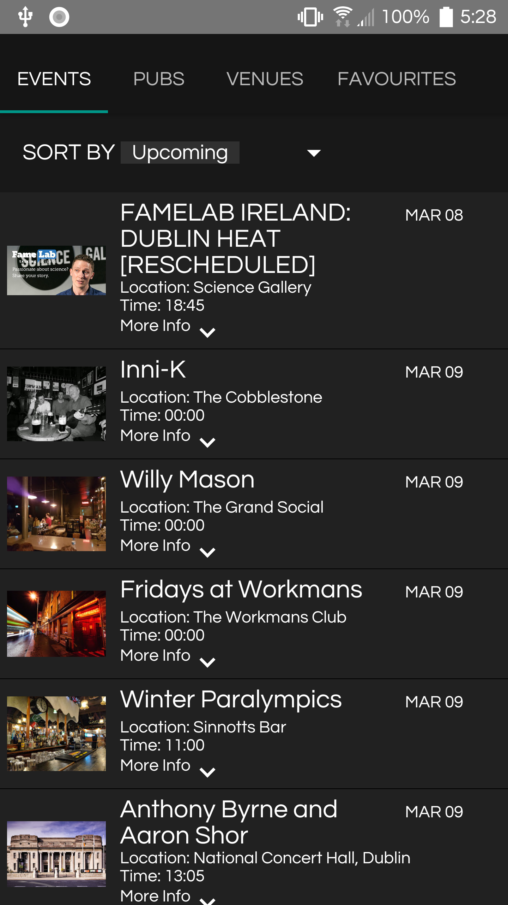
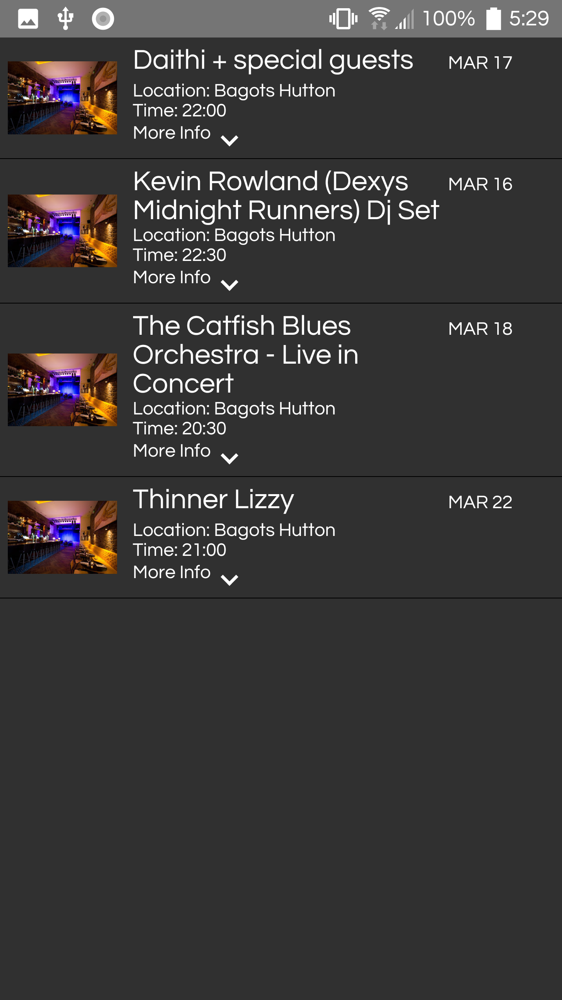
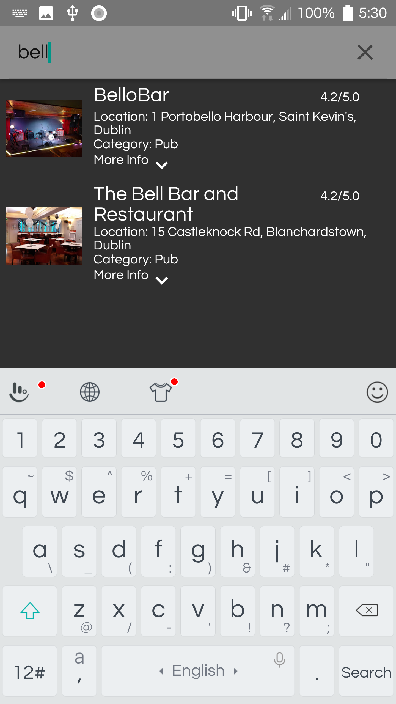
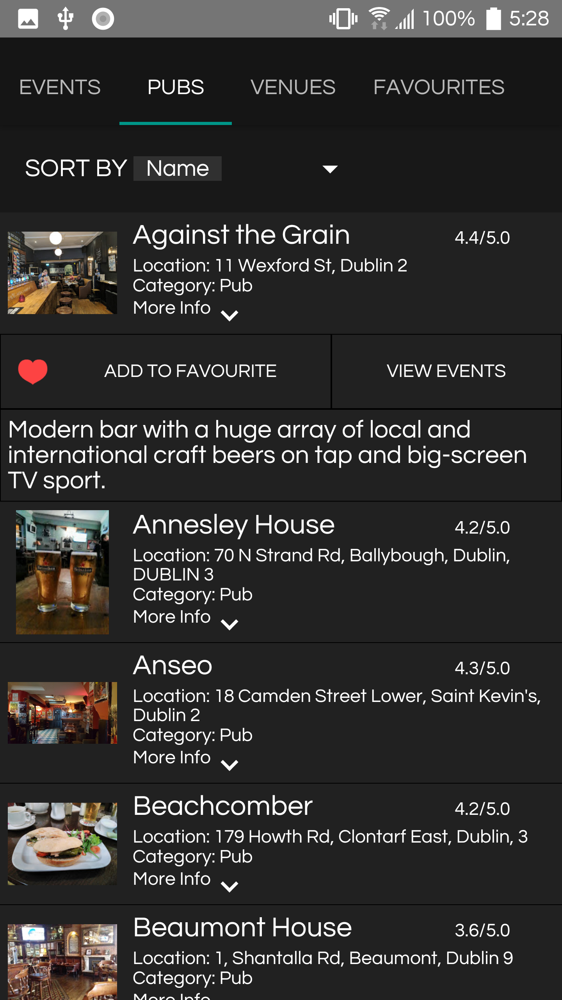
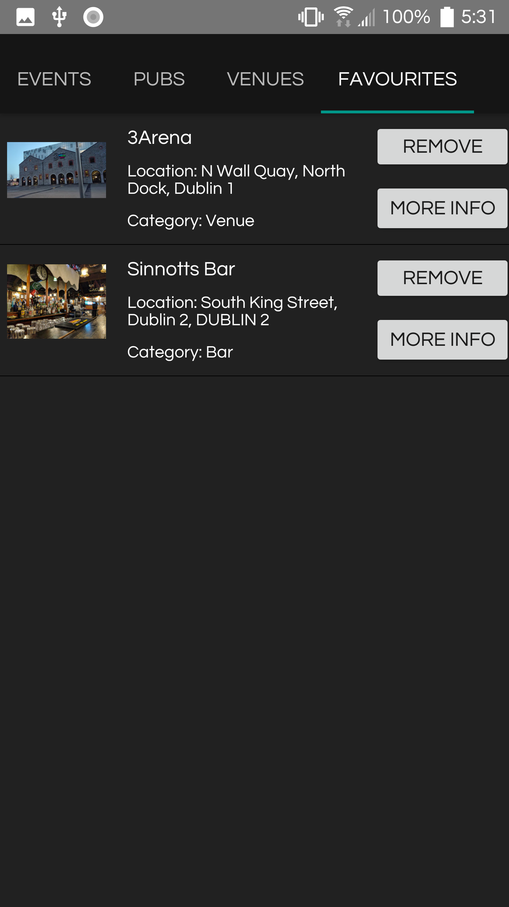

# Dublin Events App

# User Manual

## Dovydas Baranauskas, Patrick Ferry

## 1. Installation

```
a. Sign into your Google Play account.
b. Press on the search icon and enter “Dublin Events”.
c. Press the install button and wait for your application to install.
```
## 2. Starting the application

```
a. You will need to press on the application icon to open the app.
b. You will be met with the home screen which will display upcoming events sorted by date.
c. Click on the event panel for more information and extra features.
```
## 3. Switching tab views

```
a. If you would like to switch to a different tab you can press on the desired tab.
b. You can also swipe your finger from left to right or right to left depending on the location
of the tab you would like to go to.
c. Tabs are highlighted by a blue bar underneath them. You can see an example of the tabs
in figure 1.
Fig.1.1

```



## 4. Changing “Sort by” preference

```
a. You can change the way the data is displayed by simply pressing the white downward
pointing arrow.
b. Once the view is expanded you can press on any of the options provided to filter the
information by the desired output.
c. Once you press the button the view will be changed based on the clicked option.
d. In figure 1.2 you can see the expanded view of the menu.
​ Fig.1.2
```


## 5. Getting events for a venue

```
a. Click on a venue panel to expand the more info section.
b. Click on the events button.
c. This will show you all of the events occurring in that venue.
d. In figure 1.3 we see an example of a single venues events listed
​ Fig.1.3


```
## 6. Get venue information from event

```
a. Click on the event panel to expand the event view.
b. Click on the view venue button to view the venue for the specific event
c. A new page will open displaying the venue.
```
## 7. Searching for an event/venue

```
a. Go to your desired tab of the item you want to search, i.e if you would like to search for
an event press on or navigate to the event tab.
b. Click on the white arrow.
c. Choose search events.
d. Click on the search icon in the top left.
e. Enter your search query.
f. The results will be displayed to you.
g. You can see an example of a search query in figure 1.
```

```
​ Fig.1.4


```
## 8. Adding event/venue to favourites

```
a. If you would like to add a event/venue to favourites you first need to click on the
event/venue that you would like to add.
b. This will expand the panel and expose the add to favourites button.
c. Click on this button to add and event or venue to favourites.
d. The favourites button has a red heart icon to make it easier to understand the buttons
function.
e. An example of the expanded panel and the favourites button can be seen in figure 1.
```

```
​ Fig1.5


```
## 9. Viewing favourites

```
a. To view an event/venue that you have added navigate to the favourites tab by pressing
on the tab or swiping in the correct direction.
b. Once you are in the favourites tab drag your finger from the middle of the screen and
down to refresh the view if the item you have added is not there.
c. Once it is refreshed the item will be displayed.
d. Venues will have a more info and a remove button while events will only have a remove
button
e. In figure 1.6 we see the favorites tab with 2 favorited venues with information about each
venue and 2 buttons.
```

```
​ Fig.1.6



```
## 10. Removing favourite item

```
a. To remove an event/venue that you have added navigate to the favourites tab by
pressing on the tab or swiping in the correct direction.
b. Once you are in the favourites tab drag your finger from the middle of the screen and
down to refresh the view if the item you have added is not there.
c. Press the remove button beside the favourites bar to remove the item.
```
## 11. Getting venue information from favourite pubs

```
a. To get more information about a /venue that you have added navigate to the favourites
tab by pressing on the tab or swiping in the correct direction.
b. Once you are in the favourites tab drag your finger from the middle of the screen and
down to refresh the view if the item you have added is not there.
c. Click on the more info button
d. This will show you all the events for that specific venu that you have favourited.
```


